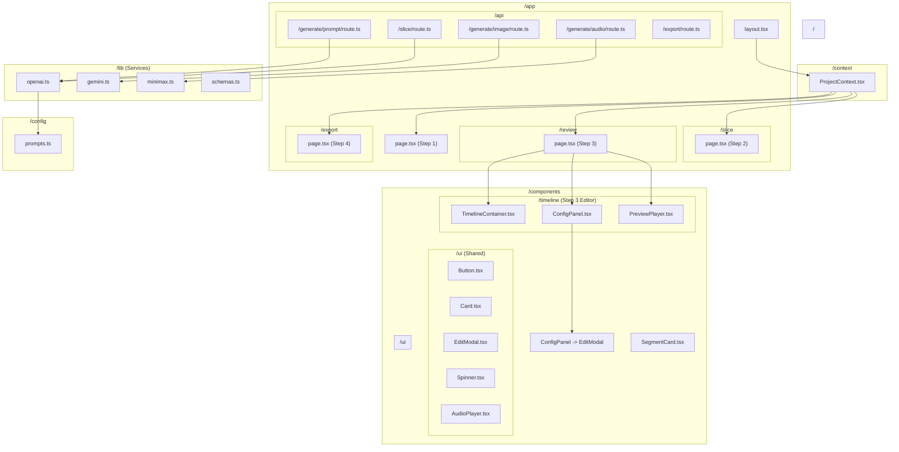

# Project Code Structure

## Directory Structure Visualization

## Key Modules

### 1. Application Flow (Next.js App Router)
- **Step 1 (Setup):** `app/page.tsx` - User inputs script, avatar, and style.
- **Step 2 (Slicing):** `app/slice/page.tsx` - AI segments the script into scenes.
- **Step 3 (Timeline Editor):** `app/review/page.tsx` - Main visual editor.
- **Step 4 (Export):** `app/export/page.tsx` - Final video generation.

### 2. State Management
- **ProjectContext:** Uses `useReducer` to handle the complex state of the video project, including segments, generated assets, and navigation history.

### 3. Timeline Editor Components
- **TimelineContainer:** Handles the horizontal scrolling tracks (Image, Text, Audio). Click-to-play enabled.
- **ConfigPanel:** Quadrant-based editor for prompts and media generation. Replaced legacy InspectorPanel.
- **PreviewPlayer:** Time-driven controlled component. Syncs perfectly with timeline selection.

### 4. AI Services (Stateless)
- **OpenAI:** Used for Script Slicing and Image Prompt Generation.
- **Gemini:** Generates images, returns as Base64.
- **Minimax:** Generates TTS audio, returns as Base64.
- **Zod:** Validates all API request payloads in `lib/schemas.ts`.
