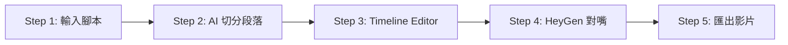

# 🏗️ Project Architecture

## 技術棧

| 層級 | 技術 |
|------|------|
| Framework | Next.js 14 (App Router) |
| Styling | Tailwind CSS |
| State Management | React Context + useReducer |
| Validation | Zod |
| AI Services | OpenAI, Google Gemini, Minimax TTS |

## 核心資料流



## 目錄結構

```
app/
├── page.tsx              # Step 1: 專案設定
├── slice/page.tsx        # Step 2: 切分段落
├── review/page.tsx       # Step 3: Timeline Editor (核心)
├── heygen/page.tsx       # Step 4: HeyGen 整合
├── export/page.tsx       # Step 5: 匯出
└── api/                  # API Routes
    ├── generate/         # Prompt/Image/Audio 生成
    └── dictionary/       # 發音字典 CRUD

components/
├── timeline/             # Timeline Editor 元件
│   ├── PreviewPlayer.tsx # 預覽播放器
│   ├── ConfigPanel.tsx   # 設定面板
│   └── TimelineContainer.tsx # 時間軸
└── ui/                   # 共用 UI 元件

lib/
├── openai.ts             # OpenAI 服務
├── gemini.ts             # Gemini 圖片生成
├── minimax.ts            # Minimax TTS
└── google-sheets.ts      # Google Sheets 字典服務

context/
└── ProjectContext.tsx    # 全域狀態管理
```

## 關鍵元件關係

### Timeline Editor (Step 3)

```
review/page.tsx (容器)
├── PreviewPlayer (預覽播放器)
│   └── 控制播放、顯示圖片
├── ConfigPanel (設定面板)
│   └── 編輯 Prompt、語音設定、發音字典
└── TimelineContainer (時間軸)
    └── 顯示段落、狀態、波形
```

## API 端點

| 端點 | 用途 |
|------|------|
| `POST /api/generate/prompt` | 生成圖片 Prompt |
| `POST /api/generate/image` | 生成圖片 (Gemini) |
| `POST /api/generate/audio` | 生成語音 (Minimax) |
| `POST /api/dictionary/save` | 保存/批次保存字典 |
| `GET /api/dictionary/all` | 取得所有字典項目 |
